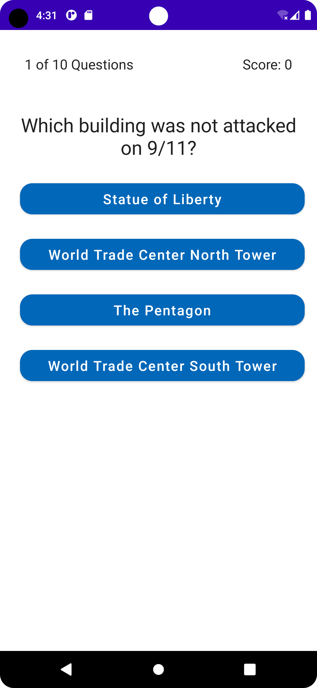
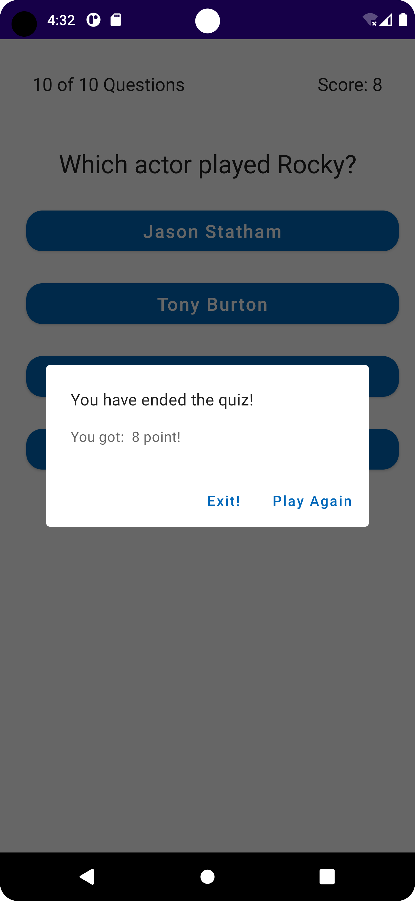

# CN333_Assignment 2

# List of contributors
#### Kantapon Makwong 6310520066
#### Sabina Llewellyn 6310610982
#### Pavisa Sirirojvorakul 6310620064

# Mobile Application function
- The questions of the quiz are randomized.
- The choices of the questions are randomized.
- Users will go through 10 questions and choose 1 answer at a time.
- Users can see their current score displayed at the top right corner of the app.
- Final score will be displayed at the end of the quiz.

## Link to the video demonstration

LinkVideo = > [Click Here.](https://youtu.be/4D0LhODJ6dM)

## Example Display QuizGame

